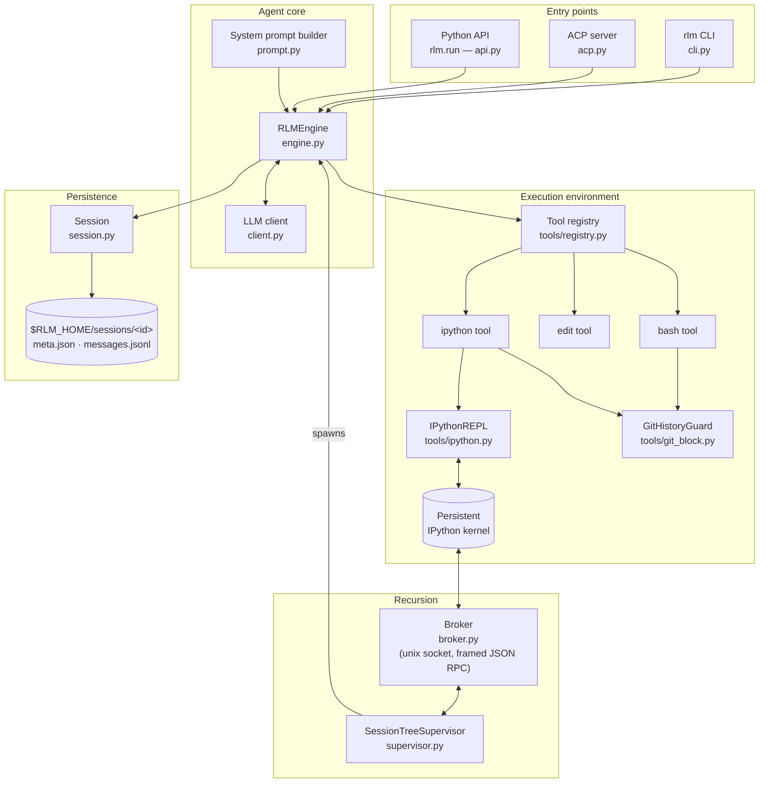
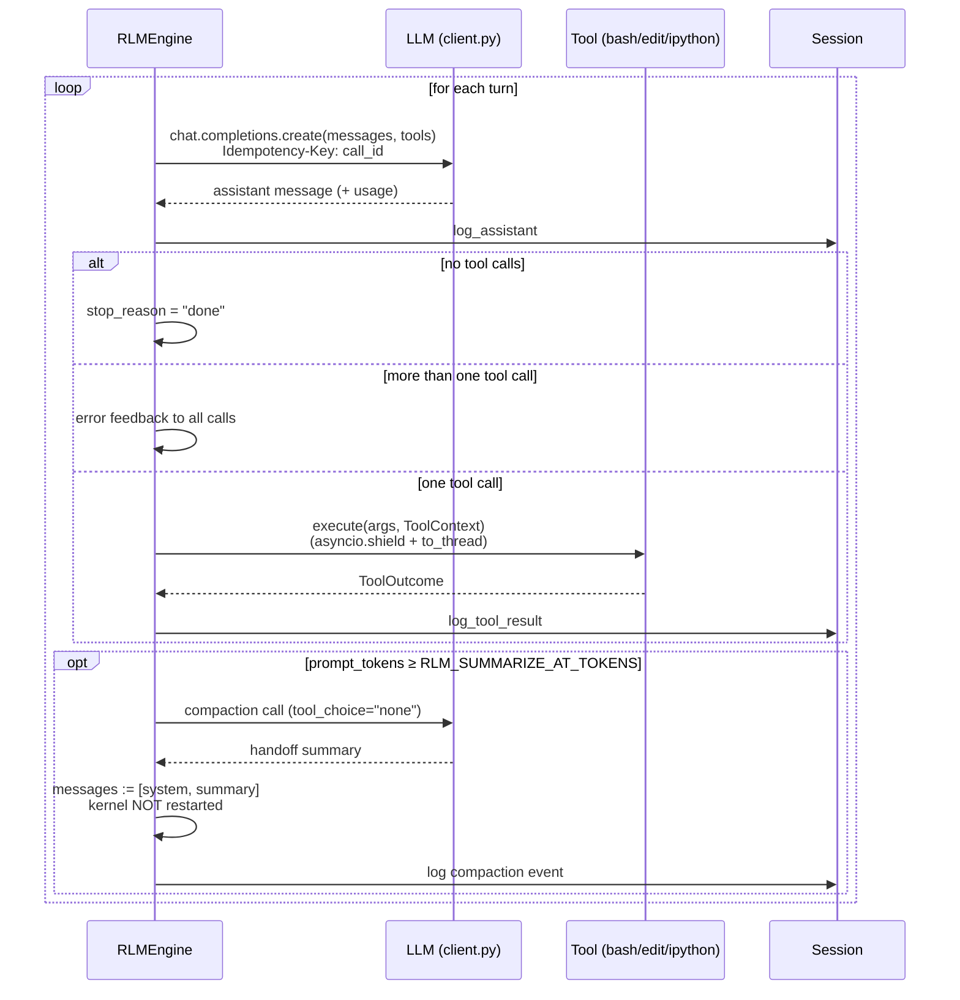
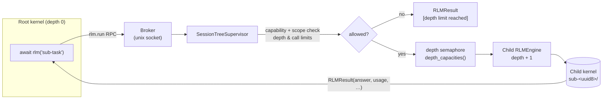
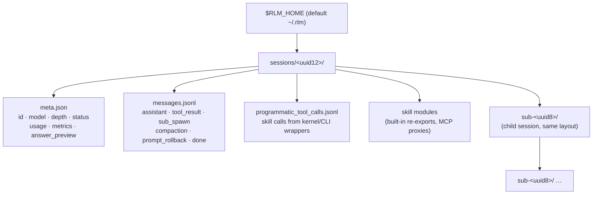

# Architecture

System shape of nano-rlm, grounded in `src/rlm/`. Diagrams use Mermaid and render natively on GitHub.

## System overview

`RLMEngine` (`src/rlm/engine.py`) is the central orchestrator. It bridges natural-language reasoning with a concrete execution space: a persistent IPython kernel, a small set of built-in tools, and a session record on disk.

## Key components

| Component | Responsibility | Source |
| ----------- | --------------- | -------- |
| `RLMEngine` | Agent loop: conversation history, tool dispatch, auto-compaction, recursion depth | `src/rlm/engine.py` |
| `IPythonREPL` | Lifecycle of the persistent Jupyter kernel (ZMQ/IPC transport) | `src/rlm/tools/ipython.py` |
| Tool registry | Active built-in tools: `bash`, `edit`, `ipython` | `src/rlm/tools/registry.py` |
| `Session` | On-disk persistence: `meta.json`, `messages.jsonl`, metrics aggregation | `src/rlm/session.py` |
| Skills system | Discovers and injects callable skills (built-in, installed, MCP) into the kernel | `src/rlm/skills/`, `src/rlm/mcp.py` |
| `GitHistoryGuard` | Blocks broad git-history access (`git log --all`, `--reflog`, …) in shell and Python | `src/rlm/tools/git_block.py` |
| `SessionTreeSupervisor` | Owns the recursion tree, depth semaphores, brokered skill calls | `src/rlm/supervisor.py` |
| Broker | Framed JSON RPC over a unix socket between kernels and the supervisor | `src/rlm/broker.py` |

## The turn loop

`_run_loop()` (`engine.py:368`) is an act–observe cycle. Exactly one built-in tool call is allowed per turn.

Tool cancellation is cooperative: on interruption the engine interrupts the kernel (`repl.interrupt()`), and recovers by restarting the kernel only if it does not return to idle within 2 seconds.

## Recursion tree

Sub-agents never spawn engines themselves — recursion always goes through the supervisor.

Guard rails: `RLM_MAX_DEPTH` (default 0 = no sub-agents), `RLM_MAX_SUBAGENT_CALLS` (default 64 per tree), `RLM_MAX_CONCURRENT_SUBAGENTS` (per-depth semaphores so nested calls cannot deadlock).

## Session layout on disk

`meta.json` is written atomically (`.tmp` + rename). `aggregate_child_metrics()` recursively merges child stats into the parent session.
