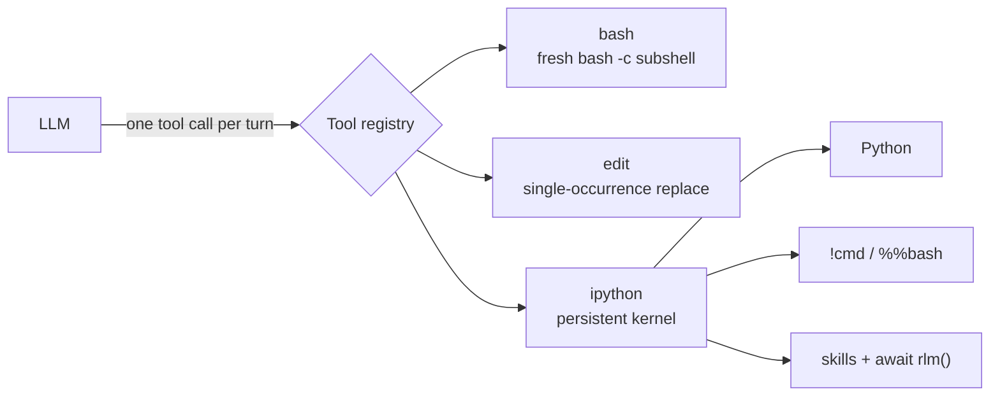
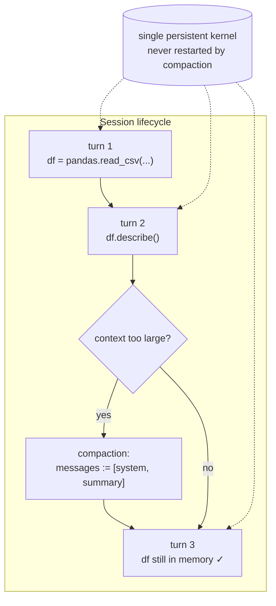
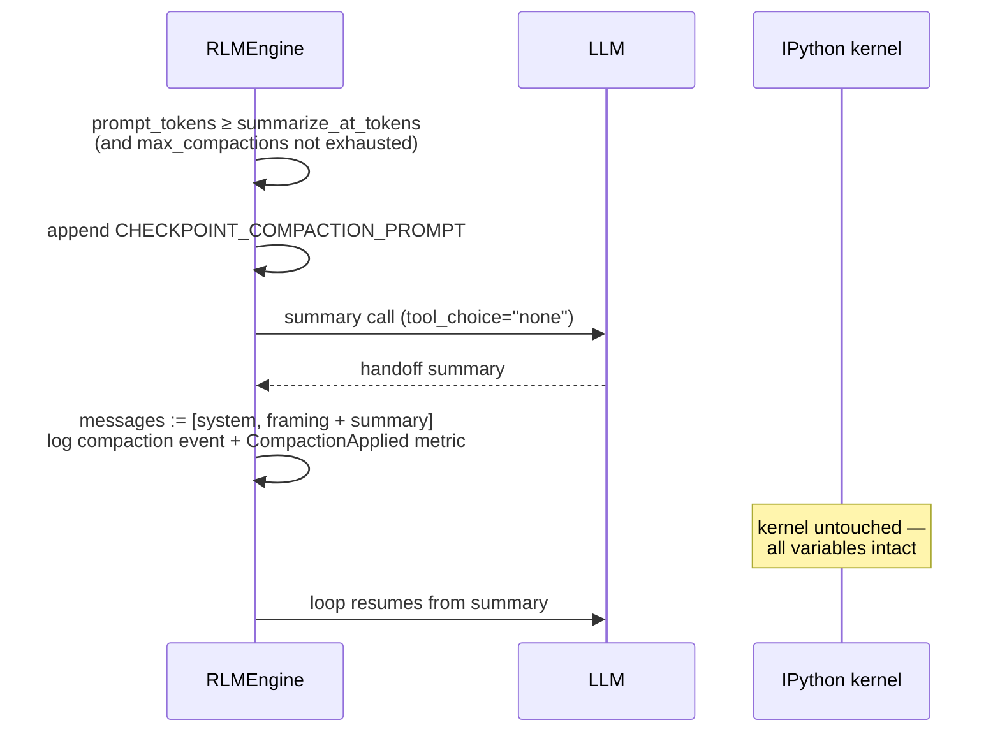
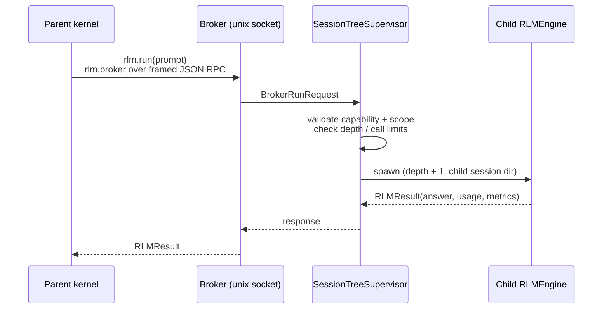
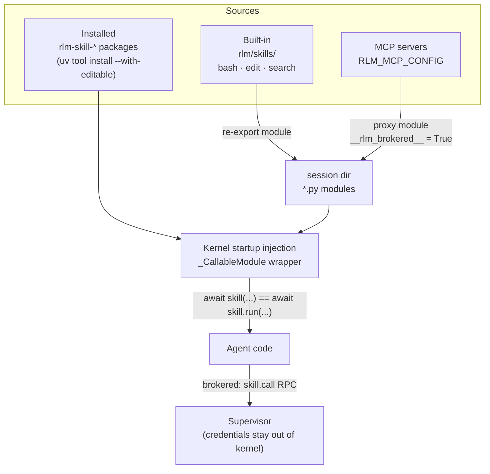
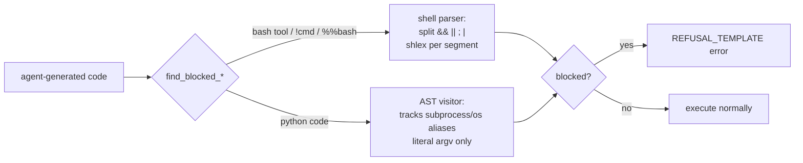

# Concepts

The design pillars of nano-rlm, per the [official documentation](https://deepwiki.com/PrimeIntellect-ai/nano-rlm) and the source.

## 1. Minimal tool interface

Instead of a large suite of specialized tools (`read_file`, `write_file`, `execute_shell`, …), the model gets a small set of high-capability built-ins — with the `ipython` tool as the centerpiece. The active set is chosen by tooling presets (`RLM_TOOLING` / `RLM_BUILTIN_TOOLS`):

The `dual` preset (default) exposes all three tools plus the `bash`/`edit` skills. Because `ipython` runs a real kernel, the agent has the full power of Python — file manipulation, data processing, HTTP, shell escapes — without bespoke tools.

## 2. Persistent state

The IPython kernel stays alive for the entire session lifecycle. Variables, imports, and in-memory data survive across turns — and across context compactions.

The kernel is also credential-isolated: `build_kernel_env()` passes a whitelist of environment variables (PATH, HOME, locale, cert vars, explicit `RLM_KERNEL_ENV` entries) — credentials are de-ambiented by omission, not filtered by name.

## 3. Context compaction

When a turn's `prompt_tokens` reaches `RLM_SUMMARIZE_AT_TOKENS`, the engine triggers a compaction turn:

If the agent stalls on the summary, a `REPL_RESTART_NOTE` reminds it that the kernel state is still available.

## 4. Native recursion

Agents spawn sub-agents by calling `await rlm("...")` inside their own kernel — hierarchical task decomposition without external orchestration.

- Depth and concurrency are bounded (`RLM_MAX_DEPTH`, `RLM_MAX_SUBAGENT_CALLS`, per-depth semaphores).
- Each child gets its own session directory (`sub-<uuid8>/`) and kernel.
- `asyncio.gather` over multiple `rlm()` calls gives parallel sub-agents.

## 5. Skills system

Three skill sources are unified into pre-imported, callable modules in the kernel namespace:

Name collisions across sources raise an error at discovery. Every programmatic skill call is logged to `programmatic_tool_calls.jsonl` for telemetry.

## 6. Git history guard

Active unless `RLM_ALLOW_GIT=1`. It blocks broad-history `git log` (e.g. `--all`, `--reflog`, `--branches`) — not git in general — so evaluation agents can't mine task solutions from history.

Documented bypasses (`getattr`, multi-hop reassignment, `__import__`) are accepted as out of scope — the guard is a tripwire, not a sandbox.
