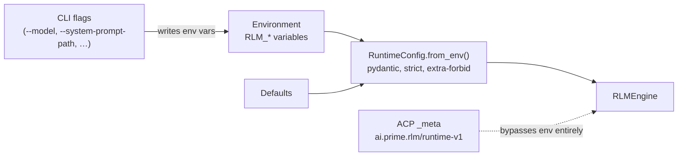
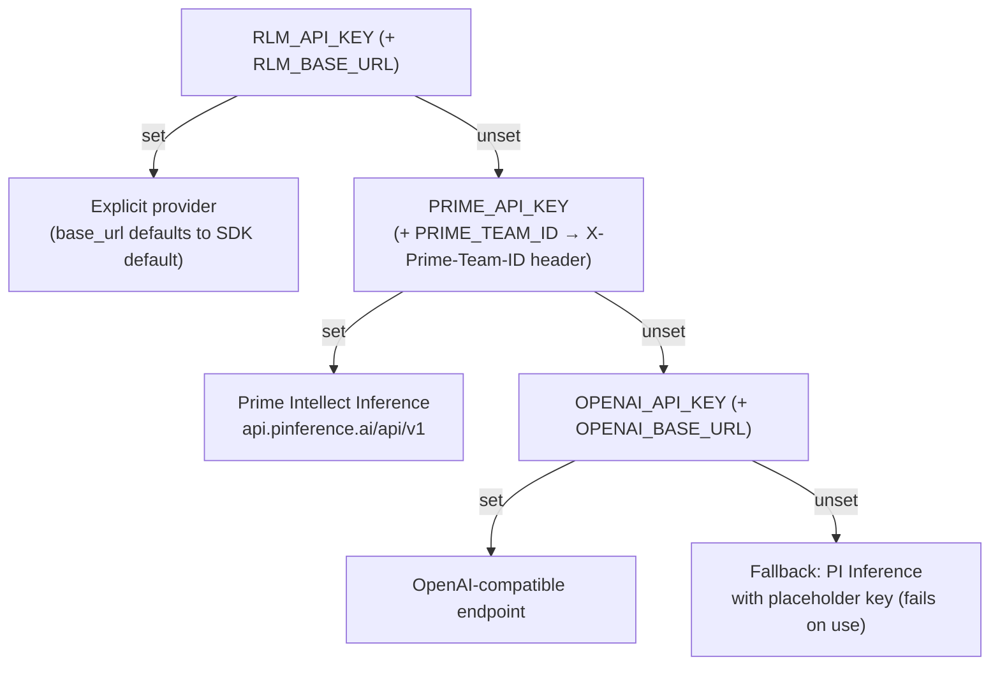
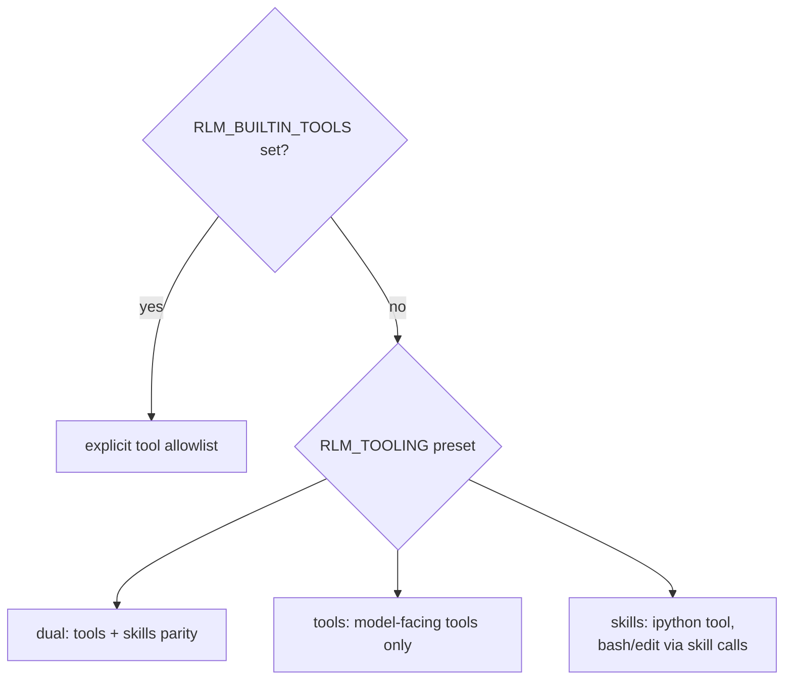
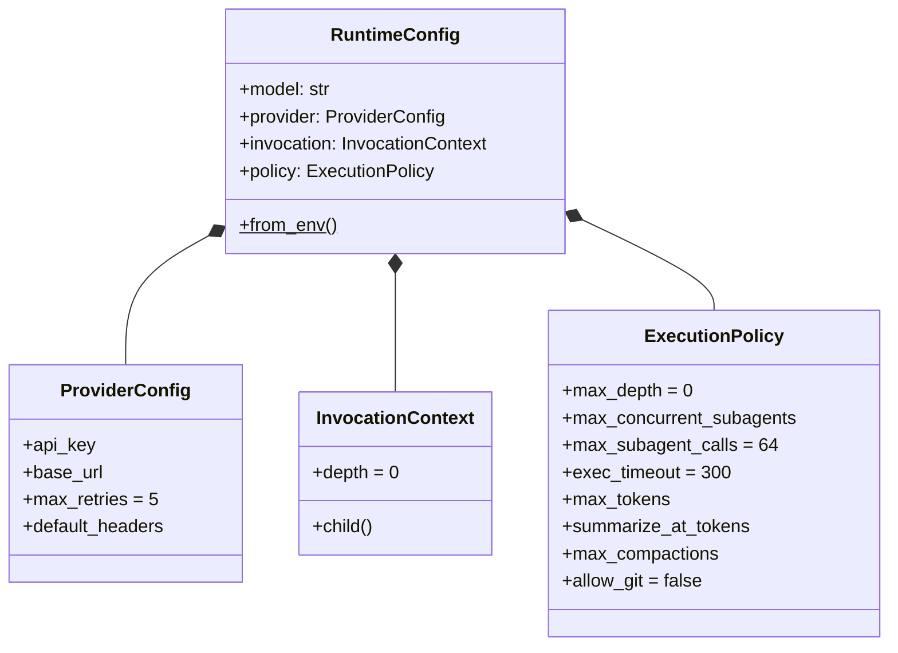

# Configuration

nano-rlm is configured entirely through environment variables, resolved by `RuntimeConfig.from_env()` (`src/rlm/config.py`). This table is generated from the source and is the authoritative reference.

## Precedence

## Provider resolution

The provider is resolved in priority order (`config.py:81-102`):

## Settings reference

### Model and provider

| Variable | Default | Meaning |
| ---------- | --------- | --------- |
| `RLM_MODEL` | `openai/gpt-5-mini` | Model slug passed to the chat completions API |
| `RLM_API_KEY` / `RLM_BASE_URL` | — | Explicit provider credentials (highest priority) |
| `PRIME_API_KEY` / `PRIME_TEAM_ID` | — | Prime Intellect Inference key / team header |
| `OPENAI_API_KEY` / `OPENAI_BASE_URL` | — | OpenAI-compatible credentials |
| `RLM_SDK_MAX_RETRIES` | `5` | Per-request SDK retries (outer wrapper retries up to ~5 min more) |

### Recursion policy

| Variable | Default | Meaning |
| ---------- | --------- | --------- |
| `RLM_MAX_DEPTH` | `0` | Max sub-agent depth; `0` disables recursion |
| `RLM_MAX_CONCURRENT_SUBAGENTS` | `max(4, RLM_MAX_DEPTH)` | Live sub-agent cap; must be ≥ `RLM_MAX_DEPTH` |
| `RLM_MAX_SUBAGENT_CALLS` | `64` | Total accepted recursive calls per session tree |
| `RLM_DEPTH` | `0` | Current depth identity — set by the supervisor in-kernel, not by users |

### Execution and budget

| Variable | Default | Meaning |
| ---------- | --------- | --------- |
| `RLM_EXEC_TIMEOUT` | `300` | Seconds per `ipython`/`bash` execution (ipython hard cap: 600) |
| `RLM_MAX_TOKENS` | unset | Completion-token budget; unset/`0` disables |
| `RLM_SUMMARIZE_AT_TOKENS` | unset | Prompt-token threshold that triggers auto-compaction |
| `RLM_MAX_COMPACTIONS` | unset | Cap on compaction turns per session |

### Tools and skills

| Variable | Default | Meaning |
| ---------- | --------- | --------- |
| `RLM_TOOLING` | `dual` | Tooling preset (see below) |
| `RLM_BUILTIN_TOOLS` | preset | Comma-separated tool allowlist; overrides the preset |
| `RLM_SKILLS` | preset skills | Built-in skills to enable (`bash`, `edit`, `search`) |
| `RLM_MCP_CONFIG` | — | Standard `mcpServers` JSON; tools become brokered skills |
| `SERPER_API_KEY` | — | Serper key for the brokered `search` skill (supervisor-only, never enters the kernel) |

### Prompt and behavior

| Variable | Default | Meaning |
| ---------- | --------- | --------- |
| `RLM_SYSTEM_PROMPT_PATH` | — | File whose contents replace the built-in system prompt |
| `RLM_APPEND_TO_SYSTEM_PROMPT` | — | Text appended to the system prompt (ignored if path is set) |
| `RLM_ALLOW_GIT` | unset | `1` disables the git-history guard |

### Environment and storage

| Variable | Default | Meaning |
| ---------- | --------- | --------- |
| `RLM_HOME` | `~/.rlm` | Root for session storage |
| `RLM_SESSION_DIR` | auto | Session dir override; set in-kernel, read by the engine |
| `RLM_KERNEL_ENV` | — | JSON object of extra env vars passed to the kernel (whitelist-based) |
| `RLM_EXTRA_UV_ARGS` | — | Extra `uv tool install` args at bootstrap (`install.sh`) |

## Tooling presets

Selected by `RLM_TOOLING`, overridable with `RLM_BUILTIN_TOOLS` (`tools/registry.py`):

| Preset | Built-in tools | Built-in skills |
| -------- | --------------- | ----------------- |
| `dual` (default) | `bash`, `edit`, `ipython` | `bash`, `edit` |
| `tools` | `bash`, `edit`, `ipython` | — |
| `skills` | `ipython` | `bash`, `edit` |

## Configuration shape

`RuntimeConfig` composes three frozen pydantic models:

All models are frozen, strict, and forbid extra fields — a typo'd setting fails fast instead of being silently ignored.
