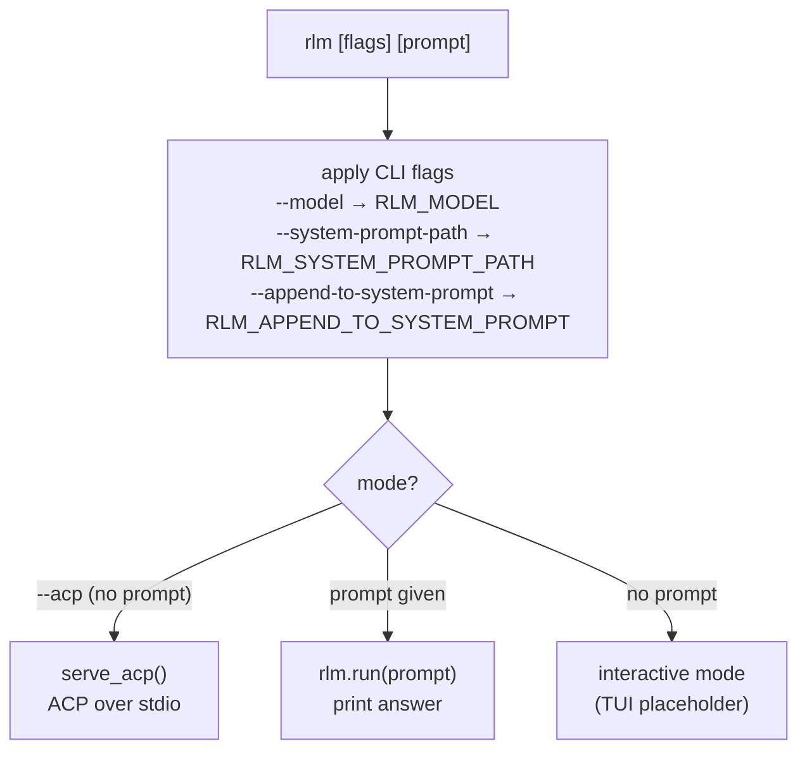
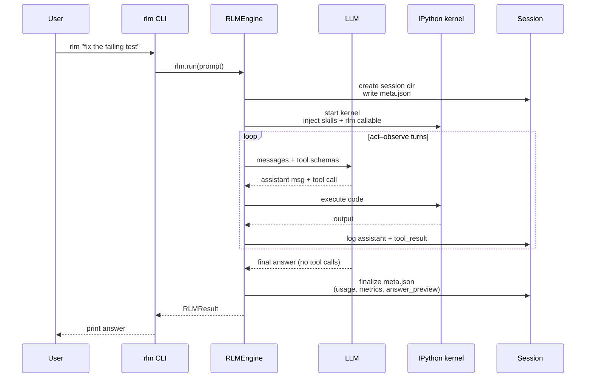
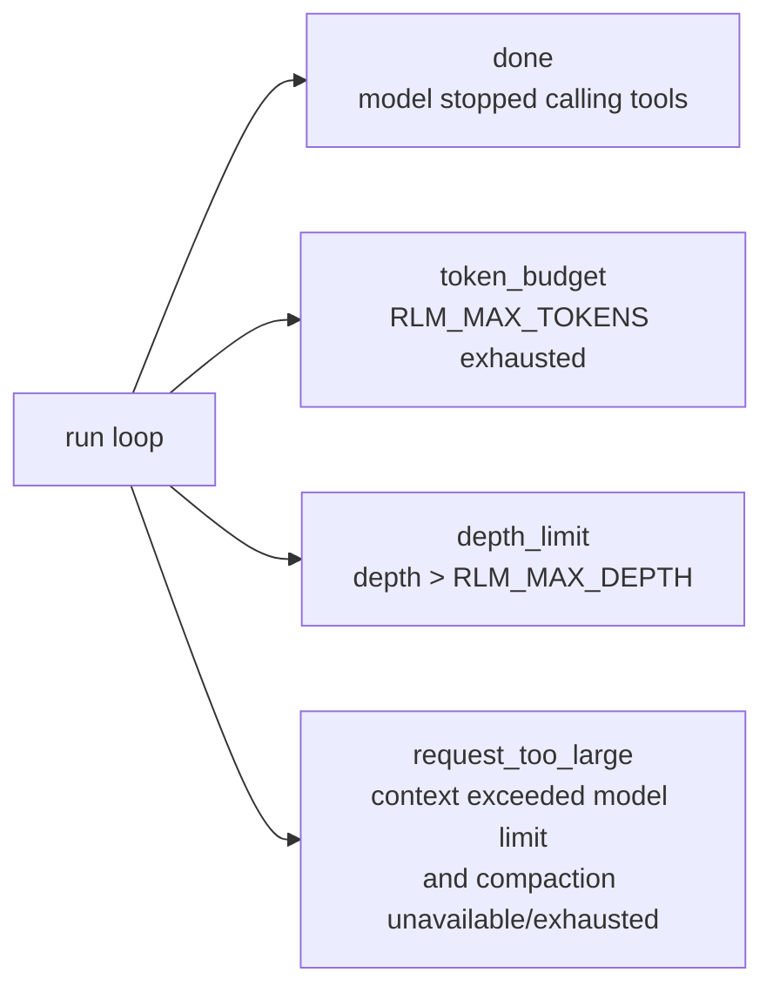
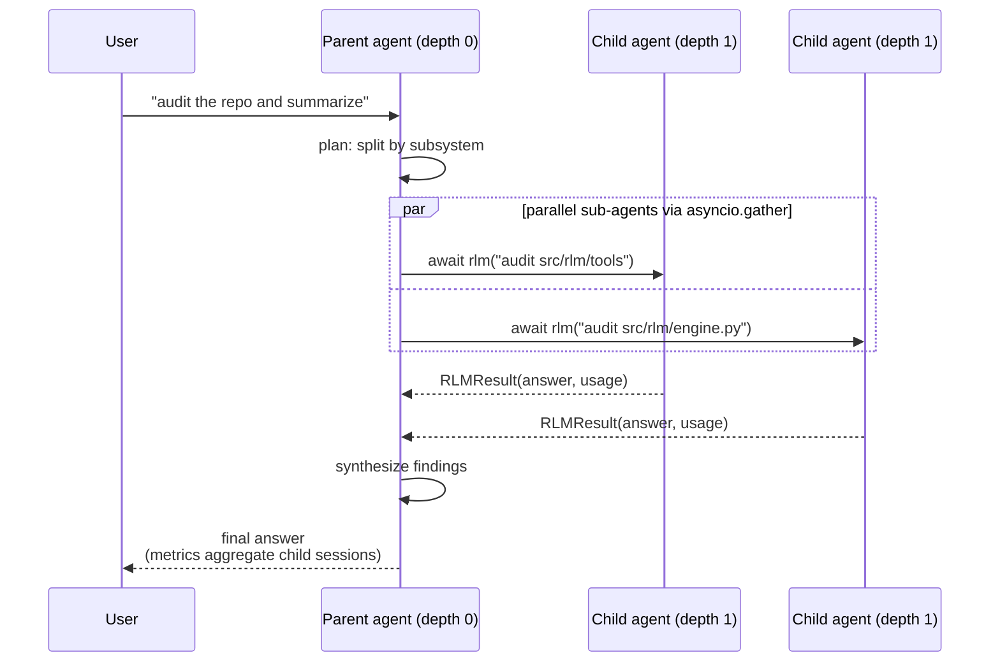
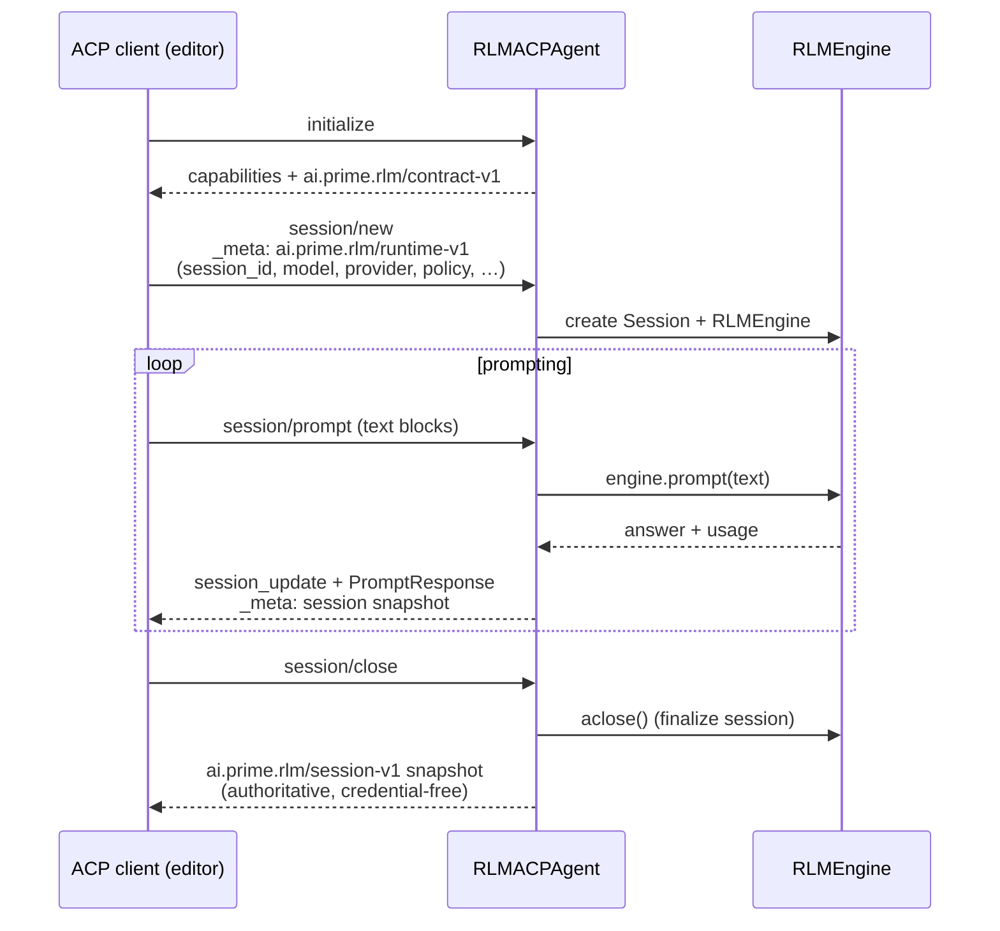

# User Flow

How a user (or a host application) drives nano-rlm, from invocation to a finished session.

## Entry flow

The `rlm` console script (`cli.py:main`) has three modes:

CLI flags simply write environment variables before config resolution, so precedence is always: CLI flag > environment > default.

## Headless run

The most common flow — one prompt, one answer:

## Stop reasons

Every run ends with a `stop_reason` recorded in metrics:

## Recursion flow (user perspective)

With `RLM_MAX_DEPTH ≥ 1`, the agent can decompose work itself:

## ACP flow (host applications)

`rlm --acp` speaks the Agent Client Protocol over stdio for editor/agent-host integration:

ACP sessions bypass environment-variable config entirely: the runtime contract in `_meta` is the full configuration. There is no `session/load` by design — sessions are not resumable over ACP.
